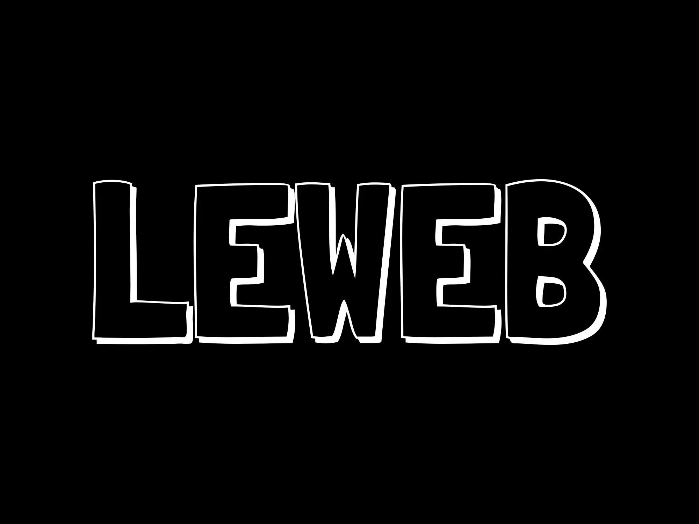

# leWeb



## Innehållsförteckning

- [Introduktion](#intro)
- [Git Workflow](#git-workflow)
  - [Git Flow](#git-flow)
  - [Namngivning av grenar](#branch-naming-conventions)
- [Riktlinjer för Pull Requests](#pull-request-guidelines)
  - [Skapa en Pull Request](#creating-a-pull-request)
  - [Granska en Pull Request](#reviewing-a-pull-request)
- [Riktlinjer för Commit-meddelanden](#commit-message-guidelines)
  - [Struktur för Commit-meddelanden](#commit-message-structure)
  - [Exempel](#examples)
  <!-- - [Riktlinjer för kodgranskning](#code-review-guidelines) -->
- [Versionshantering](#versioning)

## Intro

Detta dokument beskriver våra rutiner för Git Workflow, Pull Requests (PR) och Commit-meddelanden för att säkerställa en effektiv och ren utvecklingsprocess för vårt team.

## Git Workflow

### Git Flow

Vi följer **Git Flow**-arbetsflödet för att hantera våra grenar och versioner. Här är en kort översikt:

- **`main`**: Huvudgrenen innehåller produktionsklar kod.
- **`develop`**: Utvecklingsgrenen är där alla senaste ändringar integreras.
- **Funktionsgrenar**: Funktionsgrenar skapas från utvecklingsgrenen.
  Merga inte direkt till `develop`. Skapa istället en pull request (PR) för att föreslå ändringar.
  När funktionen är klar och PR:n är godkänd, mergas den till `develop`.
- **Release-grenar**: Release-grenar skapas från `develop` när vi förbereder en ny version. När versionen är klar mergas den till `main` och `develop`.
- **Hotfix-grenar**: Hotfix-grenar skapas från `main` för att snabbt åtgärda produktionsproblem. När hotfixen är klar mergas den till `main` och `develop`.


### Namngivning av grenar

- **Funktionsgrenar**: `feature-name`
- **Bugfix-grenar**: `bugfix/bug-name`
- **Release-grenar**: `release/version-number`
- **Hotfix-grenar**: `hotfix/issue-name`

## Riktlinjer för Pull Requests

**VIKTIGT:** Merga inte direkt till `develop`. Skapa istället en pull request (PR) för att föreslå ändringar.

### Skapa en Pull Request

1. **Gren**: Se till att din gren är uppdaterad med `develop` innan du skapar en pull request.

```bash
   git checkout develop && git pull
   eller
   git checkout develop
   git pull (origin develop)

   git checkout feature/your-feature-branch
   git merge develop
```

Anledningen till att du mergar `develop` till din funktionsgren är för att upptäcka och lösa eventuella konflikter INNAN du skapar pull requesten. Här är varför:

Medan du arbetade på din funktionsgren har andra utvecklare troligen mergat sina ändringar till `develop`.
Om dessa ändringar konflikterar med dina, är det bättre att lösa dem lokalt först.
Detta gör att din PR blir renare och mindre benägen att ha konflikter när den mergas till `develop`.

2. **Titel**: Använd en tydlig och beskrivande titel för din pull request (t.ex., `feat(api): lägg till användarautentiseringsendpoint`).
3. **Beskrivning**: Ge en detaljerad beskrivning av ändringarna, inklusive syftet med pull requesten och eventuella relaterade ärenden.
4. **Granskare**: Tilldela minst en eller två granskare till pull requesten. Dessa bör vara teammedlemmar som är bekanta med kodbasen.
5. **Etiketter**: Lägg till lämpliga etiketter (t.ex., `bug`, `enhancement`, `documentation`).

### Granska en Pull Request

1. **Kodgranskning**: Granska koden för kvalitet, läsbarhet och efterlevnad av kodstandarder.
2. **Testning**: Se till att ändringarna har testats och inte introducerar nya buggar.
3. **Kommentarer**: Ge konstruktiv feedback och begär ändringar om det behövs.
4. **Godkännande**: När pull requesten uppfyller alla kriterier, godkänn den och merga den till målgrenen.

Vem löser Pull Requests?
Primär granskare: Minst en utsedd granskare måste godkänna PR:n.

Teamets samarbete: Om PR:n påverkar flera delar av kodbasen, är det en bra idé att involvera ytterligare teammedlemmar för granskning.

Merge-ansvar: Personen som skapade PR:n eller den primära granskaren kan merga PR:n efter godkännande.

## Riktlinjer för Commit-meddelanden

### Översikt

Vårt team använder [Commitizen](https://github.com/commitizen/cz-cli) för att standardisera våra commit-meddelanden enligt [Conventional Commits](https://www.conventionalcommits.org/en/v1.0.0/)-specifikationen. Detta hjälper oss att upprätthålla en ren git-historik och automatiskt generera ändringsloggar.

### Vad gör ett bra commit-meddelande?

- Beskrivande men koncist
- Fokuserar på "vad" och "varför" snarare än "hur"
- Separerar olika problem i olika commits
- Använd imperativ form i beskrivningar ("lägg till" inte "lade till")
- Refererar till relevanta ärendenummer

### Conventional Commits-specifikationen

Conventional Commits är en specifikation för att lägga till mänsklig och maskinläsbar betydelse till commit-meddelanden. Commit-meddelandet bör vara strukturerat enligt följande:

```
<typ>[valfritt omfång]: <beskrivning>

[valfri brödtext]

[valfri sidfot]
```

### Typer

- **feat**: En ny funktion
- **fix**: En buggfix
- **docs**: Endast dokumentationsändringar
- **style**: Ändringar som inte påverkar kodens betydelse (blanksteg, formatering, etc.)
- **refactor**: En kodändring som varken fixar en bugg eller lägger till en funktion
- **perf**: En kodändring som förbättrar prestandan
- **test**: Lägga till saknade tester eller korrigera befintliga tester
- **chore**: Ändringar i byggprocessen eller hjälpverktyg och bibliotek

### Omfång

Omfånget ger ytterligare kontextuell information och är valfritt:

- **auth**: Autentiseringsrelaterade ändringar
- **core**: Kärnfunktionalitet
- **ui**: Användargränssnittskomponenter

#### _Varför använda omfång?_

Omfång hjälper till att snabbt identifiera vilken del av kodbasen som påverkas av en ändring. Detta är särskilt användbart när man genererar ändringsloggar eller söker igenom git-historiken.

### Använda Commitizen

#### Installation

```bash
# Installera commitizen globalt
npm install -g commitizen

# Initiera commitizen i ditt projekt
npm install --save-dev commitizen cz-conventional-changelog
```

#### Göra Commits

Använd istället för `git commit`:

```bash
git add .
git cz
# eller
npx cz
```

#### Exempel på commit-meddelanden:

```
feat(auth): implementera OAuth2-inloggning med Google
fix(ui): åtgärda knappjustering i navigeringsfältet
docs(api): uppdatera endpoint-dokumentation
refactor(core): förenkla databehandlingspipeline
```

Några anteckningar om hur man använder omfång i commit-meddelanden för CSS-ändringar:

Om det är rent kosmetiskt:

```bash
style(ui): justera knapputfyllnad och färger
style(nav): uppdatera stil för navigeringsfältet
style(layout): fixa responsivt rutnätsavstånd
```

Om det är en buggfix:

```bash
fix(styles): åtgärda överlappande element i mobilvy
fix(ui): korrigera knappjusteringsproblem
```

Om det är en ny visuell funktion:

```bash
feat(ui): implementera ny stil för kortkomponent
feat(styles): lägg till mörkt läge
```

### Generering av ändringsloggar

Vi genererar automatiskt ändringsloggar baserat på dessa standardiserade commit-meddelanden med hjälp av [Release Please Actions](https://github.com/googleapis/release-please). Commit-typerna används för att kategorisera ändringar i ändringsloggen:

- **feat** → Funktioner
- **fix** → Buggfixar
- **perf** → Prestandaförbättringar
- **revert** → Återställningar
- **docs**, **style**, **refactor**, **test**, **chore** → Övrigt

### Release Please

Genom att använda denna åtgärd kan vi automatiskt spåra våra conventional commits, generera/uppdatera en ändringslogg, uppdatera versioner i package.json, skapa git-taggar och publicera versioner (när de mergas).

Den skapar/uppdaterar automatiskt en PR när du pushar till `main`.
PR:n innehåller versionsuppdateringar och ändringsloggsuppdateringar.
Inga lokala kommandon behövs – allt är automatiserat via GitHub Actions.

### Brytande ändringar

Brytande ändringar ska anges i commit-meddelandets sidfot. Detta görs med hjälp av det sista steget i Commitizen-prompten.

```
feat(api): ändra autentiseringsendpointens svarsformat

BREAKING CHANGE: autentiseringssvaret returnerar nu JWT istället för sessionstoken
```

#### När ska man använda BREAKING CHANGE?

Inkludera BREAKING CHANGE i sidfoten när din commit introducerar ändringar som bryter befintlig funktionalitet, såsom:

- API-ändringar
- Ändringar i databasscheman
- Stora uppdateringar av beroenden
- Ändringar i förväntade beteenden

För ytterligare vägledning, se [Conventional Commits-specifikationen](https://www.conventionalcommits.org/en/v1.0.0/).

### Varför gör vi så här?

1. **Konsistens**: Standardiserat format för alla commits
2. **Automatisering**: Möjliggör automatisk generering av ändringsloggar
3. **Tydlighet**: Gör projektets historik mer läsbar och sökbar
4. **Versionshantering**: Hjälper till att bestämma semantiska versionsuppdateringar baserat på commit-typer
5. **Onboarding**: Gör det enklare för nya teammedlemmar att följa commit-konventioner

## Versionshantering

### Versionsschema (Semantisk versionshantering)

Vi använder Semantic Versioning (SemVer) för att versionshantera vår mjukvara. SemVer följer formatet: **HUVUD.MINDRE.PATCH**


**HUVUD:** Öka när du gör inkompatibla API-ändringar eller större ändringar som bryter bakåtkompatibilitet.
**MINDRE:** Öka när du lägger till funktionalitet på ett bakåtkompatibelt sätt (t.ex., nya funktioner).
**PATCH:** Öka när du gör bakåtkompatibla buggfixar eller små förbättringar.

### Markera versioner i Git

Följande steg är inte längre nödvändiga eftersom vi använder **Release Please** med GitHub Actions för att skapa versionsnummer och skapa en release.

> ~~När vi släpper en ny version, skapa en annoterad tagg i Git med versionsnumret. Så här gör vi det:

> ```bash
> git commit -m "chore(release): 2.0.0"
> git tag -a v2.0.0 -m "Release 2.0.0"
> git push --follow-tags
> ```

> eller bara taggen

> git tag -a v1.0.0 -m "Release version 1.0.0"
> git push origin v1.0.0
>
> ```
>
> ```

> ### När ska versionsnummer uppdateras?

> Följ dessa riktlinjer för att bestämma när du ska uppdatera patch-, minor- eller major-versionen:

> #### **Patch-version (0.0.1 → 0.0.2):**

> Öka när du fixar buggar eller gör små förbättringar som inte lägger till nya funktioner eller bryter kompatibilitet.

> Exempel: Fixa en stavfel, åtgärda en krasch eller förbättra prestandan.

> ##### **Minor-version (0.0.1 → 0.1.0):**

> Öka när du lägger till nya funktioner eller funktionalitet som är bakåtkompatibla.

> Exempel: Lägga till en ny API-endpoint, introducera en ny UI-komponent eller förbättra befintliga funktioner.

> #### **Major-version (0.1.0 → 1.0.0):**

> Öka när du gör brytande ändringar som inte är bakåtkompatibla.

> Exempel: Ta bort eller byta namn på en API, ändra beteendet hos befintliga funktioner eller göra en större arkitekturförändring.~~
